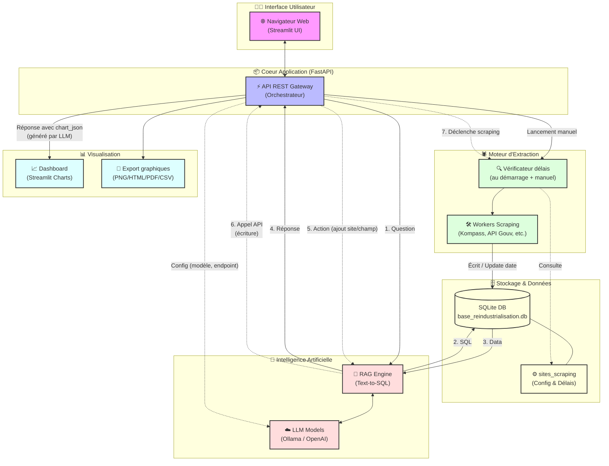
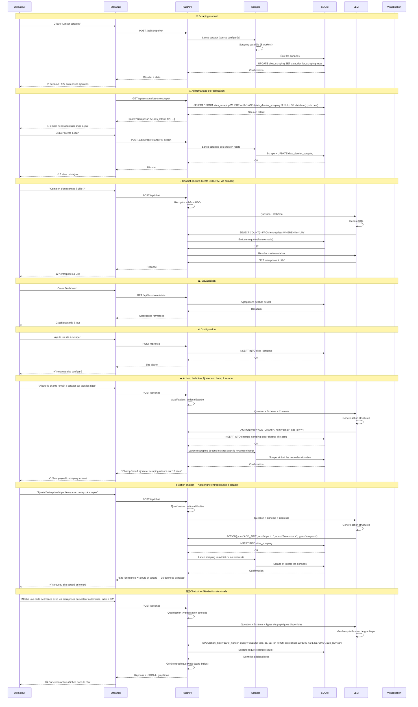
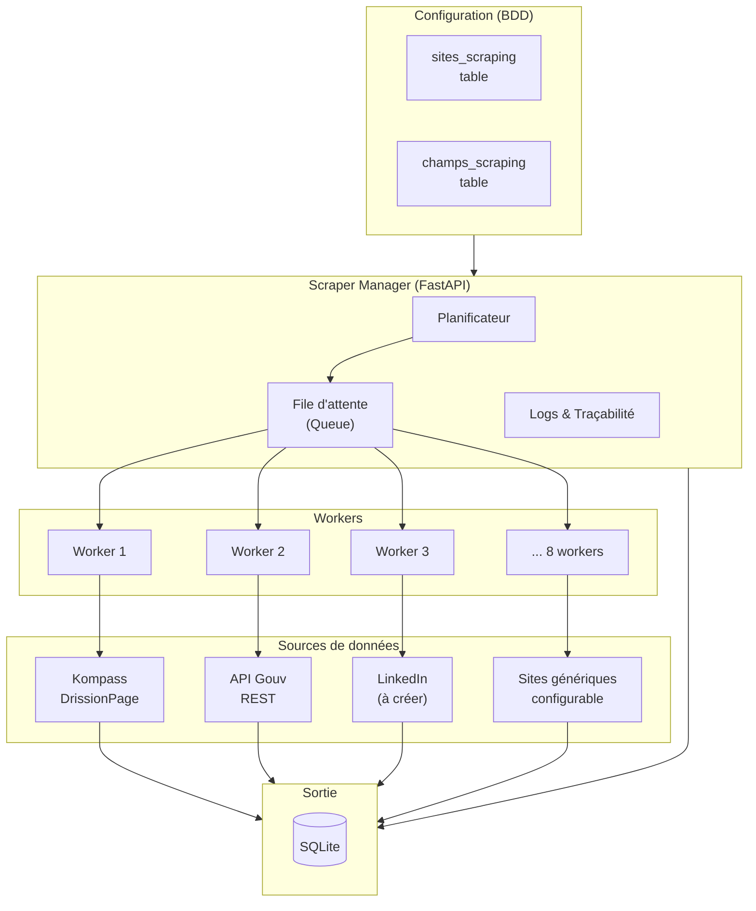
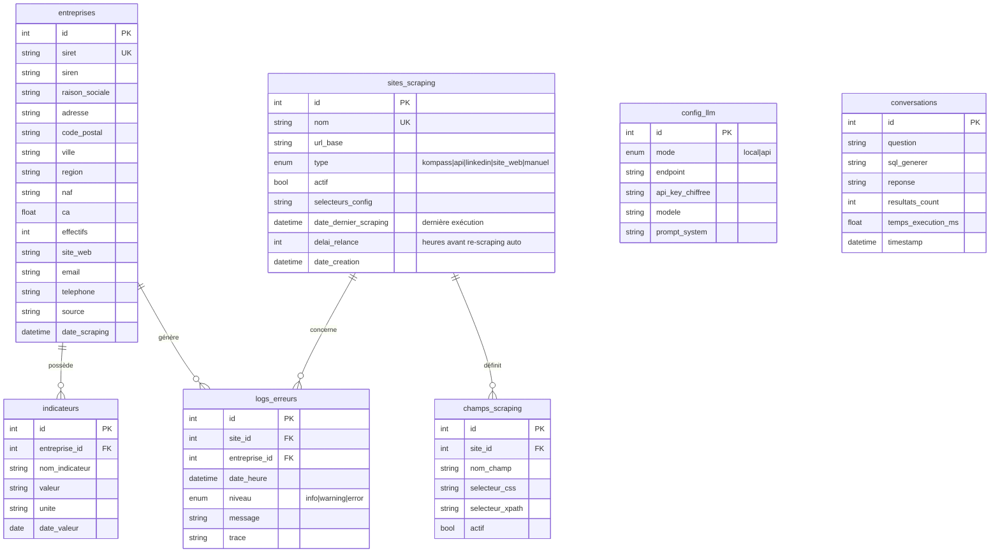
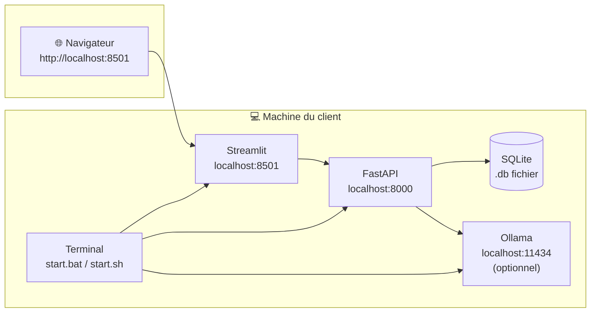

# Architecture de l'Application — Projet G1-G2

> Application de scraping multi-sources, chatbot RAG, visualisation de données et export de graphiques
> Version : 1.0 — Juin 2026

---

## Table des matières

1. [Vue d'ensemble](#1-vue-densemble)
2. [Architecture globale](#2-architecture-globale)
3. [Frontend — Interface utilisateur (Streamlit)](#3-frontend--interface-utilisateur-streamlit)
4. [Backend — API REST (FastAPI)](#4-backend--api-rest-fastapi)
5. [Moteur de scraping](#5-moteur-de-scraping)
6. [Base de données](#6-base-de-données)
7. [Chatbot RAG & LLM](#7-chatbot-rag--llm)
8. [Visualisation des données](#8-visualisation-des-données)
9. [Déploiement](#9-déploiement)
10. [Annexes](#10-annexes)

---

## 1. Vue d'ensemble

### 1.1 Problématique

Le client a besoin de :
- Collecter des données industrielles depuis **multiples sources** (Kompass, API gouvernementale, sites web, LinkedIn...)
- **Centraliser** ces données dans une base unique
- **Interroger** la base en langage naturel via un chatbot
- **Visualiser** les données sur des dashboards
- **Piloter** l'ensemble (scraping, configuration, mise à jour) depuis une interface unique
- Garder le contrôle : tout doit fonctionner **en local**, sans abonnement cloud obligatoire

### 1.2 Périmètre fonctionnel

| Fonctionnalité | Description |
|----------------|-------------|
| Scraping multi-sources | Kompass, API Gouv, LinkedIn, sites web génériques |
| Configuration dynamique | Ajouter/supprimer des sites et champs sans modifier le code |
| Base de données centralisée | SQLite, toutes les sources dans la même base |
| Chatbot RAG | Questions en français, réponses depuis la BDD |
| Actions chatbot | Ajouter des champs/sites à scraper et lancer le scraping via le chat |
| Visuels chatbot | Générer graphiques et cartes interactives en langage naturel |
| LLM flexible | Local (Ollama) ou API (OpenAI, Mistral...) au choix |
| Visualisation | Graphiques générés par le LLM + export PNG/HTML/PDF/CSV |
| Traçabilité | Logs d'erreurs, historique des conversations |

---

## 2. Architecture globale

### 2.1 Schéma d'architecture



### 2.2 Flux de données



### 2.3 Composants principaux

| Composant | Technologie | Rôle |
|-----------|-------------|------|
| Frontend | **Streamlit** | Interface utilisateur (dashboard, chat, config) |
| Backend | **FastAPI** | API REST, orchestration, logique métier |
| Scraping | **DrissionPage** | Extraction de données depuis le web |
| Base de données | **SQLite** | Stockage centralisé de toutes les données |
| Chatbot | **LangChain + Ollama/OpenAI** | RAG, Text-to-SQL, actions écriture (ajout site/champ + scraping) |
| Visualisation | **Streamlit Charts** | Graphiques et rapports |

---

## 3. Frontend — Interface utilisateur (Streamlit)

### 3.1 Structure de l'interface

L'application Streamlit est organisée en **4 onglets** :

```
app.py
├── Onglet 1 : 📊 Dashboard
│   ├── KPIs : nombre d'entreprises, CA moyen, répartition géographique
│   ├── Graphiques : secteurs d'activité, évolution, carte
│   └── Dernier scraping : date, statut, compteurs
│
    ├── Onglet 2 : 🕷️ Scraping
    │   ├── Notification : "X sites nécessitent une mise à jour" (au démarrage)
    │   ├── Boutons : Lancer / Arrêter / Vérifier les délais
    │   ├── Progression : barre de progression + logs en direct
    │   ├── Configuration sites : lister, ajouter, modifier, supprimer
    │   └── Configuration champs : lister, ajouter, activer/désactiver
│
├── Onglet 3 : 💬 Chat RAG
│   ├── Sélecteur LLM : Ollama (local) / OpenAI (API)
│   ├── Champ de texte : poser une question
│   └── Historique : conversation avec les réponses
│
    └── Onglet 4 : ⚙️ Configuration
        ├── LLM : endpoint, modèle, clé API
        ├── Base de données : chemin, taille, tables
        ├── Export : format par défaut (PNG, HTML, PDF, CSV)
        └── À propos : version, licence
```

### 3.2 Maquette fonctionnelle

```
┌─────────────────────────────────────────────────────────────┐
│  🏠 Dashboard  │  🕷️ Scraping  │  💬 Chat  │  ⚙️ Config  │
├─────────────────────────────────────────────────────────────┤
│                                                             │
│  ┌───────────────────┐  ┌───────────────────┐              │
│  │  📊 Entreprises   │  │  💰 CA Total      │              │
│  │     1 247         │  │     2.3 Mds €     │              │
│  └───────────────────┘  └───────────────────┘              │
│  ┌───────────────────┐  ┌───────────────────┐              │
│  │  🌍 Régions       │  │  🏭 Secteurs      │              │
│  │    [Carte]        │  │    [Pie chart]    │              │
│  └───────────────────┘  └───────────────────┘              │
│                                                             │
│  Dernier scraping : 02/06/2026 14:32 · ✅ Succès            │
│  127 nouvelles entreprises                                │
│                                                             │
└─────────────────────────────────────────────────────────────┘
```

---

## 4. Backend — API REST (FastAPI)

### 4.1 Structure du backend

```
backend/
├── main.py                  # Point d'entrée FastAPI
├── config.py                # Configuration (BDD, LLM, .env...)
├── database.py              # Connexion SQLite, sessions
├── models/                  # Modèles SQLAlchemy / Pydantic
│   ├── entreprise.py
│   ├── site.py
│   ├── champ.py
│   └── conversation.py
├── routers/                 # Endpoints API
│   ├── scraping.py          # POST /api/scrape/run, status, stop
│   ├── sites.py             # CRUD /api/sites
│   ├── champs.py            # CRUD /api/champs
│   ├── chat.py              # POST /api/chat
│   ├── config_llm.py        # GET/PUT /api/config/llm
│   └── export.py            # POST /api/export
├── services/                # Logique métier
│   ├── scraper_manager.py   # Orchestrateur de scraping
│   ├── llm_adapter.py       # Adapter Ollama / OpenAI
│   └── rag_engine.py        # Text-to-SQL
└── utils/
    ├── security.py          # Chiffrement clés API
    └── schemas.py           # Schémas Pydantic
```

### 4.2 Liste complète des endpoints

| Méthode | Endpoint | Description |
|---------|----------|-------------|
| **Scraping** | | |
| `POST` | `/api/scrape/run` | Lancer le scraping (tous sites ou par source) |
| `GET` | `/api/scrape/status` | Statut du scraping en cours |
| `POST` | `/api/scrape/stop` | Arrêter le scraping |
| `GET` | `/api/scrape/logs` | Historique des derniers scrapings |
| `GET` | `/api/scrape/sites-a-rescraper` | Lister les sites dont le délai est dépassé |
| `POST` | `/api/scrape/relancer-si-besoin` | Vérifier et lancer le scraping des sites en retard |
| | | |
| **Sites** | | |
| `GET` | `/api/sites` | Lister tous les sites configurés |
| `POST` | `/api/sites` | Ajouter un nouveau site |
| `GET` | `/api/sites/{id}` | Détail d'un site |
| `PUT` | `/api/sites/{id}` | Modifier un site |
| `DELETE` | `/api/sites/{id}` | Supprimer un site |
| | | |
| **Champs** | | |
| `GET` | `/api/champs` | Lister tous les champs |
| `POST` | `/api/champs` | Ajouter un champ à scraper |
| `PUT` | `/api/champs/{id}` | Modifier un champ |
| `DELETE` | `/api/champs/{id}` | Supprimer un champ |
| | | |
| **Chat / LLM** | | |
| `POST` | `/api/chat` | Envoyer une question au chatbot |
| `GET` | `/api/chat/history` | Historique des conversations |
| `GET` | `/api/config/llm` | Voir la configuration LLM |
| `PUT` | `/api/config/llm` | Changer le mode LLM |
| `GET` | `/api/config/llm/models` | Lister les modèles disponibles |
| | | |
| **Export** | | |
| `POST` | `/api/export` | Exporter un graphique au format souhaité (PNG, HTML, PDF, CSV) |
| | |
| **Dashboard** | | |
| `GET` | `/api/dashboard/stats` | Statistiques globales pour le dashboard |
| `GET` | `/api/dashboard/evolution` | Évolution dans le temps |
| `GET` | `/api/dashboard/geography` | Répartition géographique |

### 4.3 Contrat API — Exemple

**Requête :**
```http
POST /api/chat
Content-Type: application/json

{
  "question": "Quelles sont les entreprises avec un CA > 10M€ dans les Hauts-de-France ?",
  "mode_llm": "local",
  "conversation_id": null
}
```

**Réponse :**
```json
{
  "reponse": "127 entreprises correspondent à vos critères dans les Hauts-de-France. Les 5 premières sont :\n1. **VALEO** (Lille, 45M€)\n2. **ARCELLOR** (Dunkerque, 38M€)\n...",
  "sql_generé": "SELECT * FROM entreprises WHERE ca > 10000000 AND region = 'Hauts-de-France' ORDER BY ca DESC LIMIT 5",
  "resultats_count": 127,
  "temps_execution_ms": 234
}
```

---

## 5. Moteur de scraping

### 5.1 Architecture du scraping



### 5.2 Interface commune des scrapers

Chaque source suit le même contrat pour garantir l'interchangeabilité :

```python
class BaseScraper(ABC):
    """Interface commune que tous les scrapers doivent implémenter."""

    @abstractmethod
    def run(self, config: dict, progression: callable) -> list[dict]:
        """
        Lance le scraping d'une source.

        Args:
            config: Configuration du site (URL, sélecteurs...)
            progression: Callback pour reporter l'avancement

        Returns:
            Liste de dictionnaires (données normalisées)
        """
        pass

    @property
    @abstractmethod
    def nom_source(self) -> str:
        """Identifiant unique de la source (ex: 'kompass', 'linkedin')."""
        pass
```

### 5.3 Scrapers disponibles

| Scraper | Technologie | Source | Statut |
|---------|-------------|--------|--------|
| `kompass.py` | DrissionPage (8 workers) | Kompass.com | ✅ Existant |
| `api_gouv.py` | Requests (REST) | data.gouv.fr | ✅ Existant |
| `linkedin.py` | À définir | LinkedIn | 🔧 À créer |
| `sites_generiques.py` | DrissionPage configurable | Sites web arbitraires | 🔧 À créer |

### 5.4 Vérification des mises à jour au démarrage

Au lieu d'un planificateur en arrière-plan, le système vérifie l'état des sites **au démarrage de l'application** et **à la demande** via un bouton dans l'interface.

#### Principe

Chaque site dans `sites_scraping` a deux champs clés :
- **`date_dernier_scraping`** : horodatage de la dernière exécution (mis à jour automatiquement par le scraper)
- **`delai_relance`** : nombre d'heures avant de rescraper automatiquement ce site (défaut : 72h)

#### Flux au démarrage

```
1. L'utilisateur ouvre l'application Streamlit
2. Le frontend appelle GET /api/scrape/sites-a-rescraper
3. L'API exécute cette requête :
```
```sql
SELECT *, 
  ROUND(julianday('now') - julianday(date_dernier_scraping), 1) AS jours_ecart
FROM sites_scraping
WHERE actif = 1
  AND (
    date_dernier_scraping IS NULL
    OR datetime(date_dernier_scraping, '+' || delai_relance || ' hours') <= datetime('now')
  )
ORDER BY jours_ecart DESC
```
```
4. L'API retourne la liste des sites en retard avec leur délai dépassé
5. Le frontend affiche une notification : "🔔 3 sites nécessitent une mise à jour"
6. L'utilisateur clique "Mettre à jour" → POST /api/scrape/relancer-si-besoin
7. Le scraper s'exécute uniquement sur les sites en retard
```

#### Endpoints associés

| Méthode | Endpoint | Description |
|---------|----------|-------------|
| `GET` | `/api/scrape/sites-a-rescraper` | Lister les sites dont le délai est dépassé (lecture seule) |
| `POST` | `/api/scrape/relancer-si-besoin` | Vérifier et lancer le scraping des sites en retard |

#### Code côté backend

```python
# Au démarrage de FastAPI
@app.on_event("startup")
async def demarrage():
    """Vérification initiale au démarrage de l'API."""
    pass  # La vérification est déclenchée par le frontend, pas automatiquement

# Endpoint de vérification
@app.get("/api/scrape/sites-a-rescraper")
def lister_sites_en_retard():
    query = """
        SELECT *, ROUND(julianday('now') - julianday(date_dernier_scraping), 1) AS jours_ecart
        FROM sites_scraping
        WHERE actif = 1 AND (
            date_dernier_scraping IS NULL
            OR datetime(date_dernier_scraping, '+' || delai_relance || ' hours') <= datetime('now')
        )
        ORDER BY jours_ecart DESC
    """
    sites = db.execute(query).fetchall()
    return {
        "sites_en_retard": len(sites),
        "sites": [dict(s) for s in sites]
    }

# Endpoint de relance
@app.post("/api/scrape/relancer-si-besoin")
def relancer_scraping():
    sites = lister_sites_en_retard()
    if not sites["sites"]:
        return {"message": "Aucun site à mettre à jour"}
    run_scraping(sources=[s["id"] for s in sites["sites"]])
    return {
        "message": f"{len(sites['sites'])} sites relancés",
        "sites": sites["sites"]
    }
```

#### Code côté frontend Streamlit

```python
# Dans app.py — vérification au démarrage
if "sites_verifies" not in st.session_state:
    response = requests.get(f"{API_URL}/scrape/sites-a-rescraper")
    st.session_state.sites_en_retard = response.json()
    st.session_state.sites_verifies = True

# Notification
nb_sites = st.session_state.sites_en_retard["sites_en_retard"]
if nb_sites > 0:
    st.warning(f"🔔 **{nb_sites} site(s) nécessitent une mise à jour**")
    if st.button("🔄 Mettre à jour maintenant"):
        with st.spinner("Scraping en cours..."):
            reponse = requests.post(f"{API_URL}/scrape/relancer-si-besoin")
            st.success(reponse.json()["message"])
```

Le chatbot interroge la BDD **directement** — le scraper n'est jamais un intermédiaire entre le chatbot et les données.

### 5.5 Scraping dynamique

Le moteur lit la configuration en base de données à chaque exécution :

```python
# Scraper Manager — lecture dynamique de la config
def run_scraping(sources: list[str] = None):
    # 1. Récupère les sites actifs depuis la BDD
    query = "SELECT * FROM sites_scraping WHERE actif = 1"
    if sources:
        query += " AND nom IN :sources"
    sites = db.execute(query, {"sources": sources})

    # 2. Pour chaque site, récupère les champs à scraper
    for site in sites:
        champs = db.execute(
            "SELECT * FROM champs_scraping WHERE site_id = ? AND actif = 1",
            [site.id]
        )
        # 3. Instancie le bon scraper et exécute
        scraper = get_scraper(site.type)  # kompass, api, linkedin...
        donnees = scraper.run({
            "url": site.url_base,
            "champs": champs
        })
        # 4. Sauvegarde en BDD
        batch_insert(db, "entreprises", donnees)
```

**Résultat :** pour ajouter un site ou un champ, il suffit d'insérer une ligne en BDD. Le code ne change jamais.

---

## 6. Base de données

### 6.1 Schéma relationnel



### 6.2 Description des tables

| Table | Description | Source |
|-------|-------------|--------|
| `entreprises` | Données scrapées de toutes les sources | Scraping |
| `indicateurs` | Indicateurs financiers et opérationnels | Scraping / Calculs |
| `sites_scraping` | Configuration des sites à scraper | Manuel / IA |
| `champs_scraping` | Champs à extraire sur chaque site | Manuel / IA |
| `logs_erreurs` | Traçabilité des scrapings et erreurs | Automatique |
| `config_llm` | Configuration du LLM (mode, clé...) | Manuel |
| `conversations` | Historique des questions/réponses du chat | Automatique |

### 6.3 Stockage physique

- **Format** : SQLite (fichier unique `.db`)
- **Emplacement** : `data/base_reindustrialisation.db`
- **Taille** : quelques Mo à quelques Go selon le volume
- **Évolution possible** : PostgreSQL si multi-utilisateur ou volume > 10 Go

---

## 7. Chatbot RAG & LLM

### 7.1 Pipeline RAG

Le chatbot supporte trois modes : **interrogation (lecture)**, **action (écriture)** et **visualisation**.

```mermaid
flowchart TB
    Q["💬 Question utilisateur<br>ex: 'Affiche une carte des entreprises du secteur automobile'"]
    QC["🔍 Qualification<br>Question : Lecture, Action ou Visuel ?"]

    %% Branche Lecture (Text-to-SQL)
    subgraph Lecture["📖 Mode Lecture (Text-to-SQL)"]
        Schema["📋 Récupération du schéma BDD<br>Tables, colonnes, types"]
        Prompt["📝 Construction du prompt<br>Question + Schéma + Contexte"]
        LLM["🤖 LLM appelé<br>Ollama (local) ou OpenAI (API)"]
        SQL["📄 Génération SQL<br>SELECT ..."]
        Execution["⚡ Exécution SQL<br>Lecture seule"]
        Result["📊 Résultat brut"]
        Reformulation["🔄 Reformulation"]
        ResponseL["💬 Réponse finale"]
        Schema --> Prompt --> LLM --> SQL --> Execution --> Result --> Reformulation --> ResponseL
    end

    %% Branche Action (écriture)
    subgraph Action["✏️ Mode Action (Écriture)"]
        SchemaA["📋 Récupération schéma BDD<br>+ Liste sites/champs actuels"]
        PromptA["📝 Prompt d'action<br>Question + Schéma + Actions possibles"]
        LLMa["🤖 LLM appelé"]
        ActionGen["📋 Génération d'action structurée<br>{ type, params }"]
        Validation["✅ Validation & confirmation<br>(humaine si critique)"]
        ExecAction["⚡ Exécution via API<br>POST /api/sites ou /api/champs"]
        TriggerScrape["🕷️ Déclenchement scraping"]
        ResponseA["💬 Réponse finale<br>'Champ ajouté, scraping relancé'"]
        SchemaA --> PromptA --> LLMa --> ActionGen --> Validation --> ExecAction --> TriggerScrape --> ResponseA
    end

    %% Branche Visualisation
    subgraph Viz["📊 Mode Visualisation"]
        SchemaV["📋 Récupération schéma BDD<br>+ infos géographiques"]
        PromptV["📝 Prompt de visualisation<br>Question + Schéma + Types de graphiques disponibles"]
        LLMv["🤖 LLM appelé"]
        SpecGen["📐 Génération de spécification<br>{ chart_type, query, mapping }"]
        SQLv["⚡ Exécution SQL"]
        DataV["📦 Données récupérées"]
        ChartGen["🎨 Génération du graphique<br>Plotly (carte, barres, camembert...)"]
        ResponseV["🖼️ Réponse + Graphique intégré"]
        SchemaV --> PromptV --> LLMv --> SpecGen --> SQLv --> DataV --> ChartGen --> ResponseV
    end

    Q --> QC
    QC -->|"Question (ex: combien ?)"| Lecture
    QC -->|"Action (ex: ajoute, crée)"| Action
    QC -->|"Visuel (ex: affiche, carte, graphique)"| Viz
    QC -->|Hors sujet| Refus["❌ Je ne peux répondre<br>qu'aux questions sur la BDD"]
```



### 7.2 Modes LLM

| Mode | Technologie | Avantages | Inconvénients |
|------|-------------|-----------|---------------|
| **Local** | Ollama (llama3, mistral, qwen) | Gratuit, confidentiel, sans internet | Moins performant, nécessite RAM |
| **API** | OpenAI, Mistral API, Anthropic | Plus rapide, plus précis | Nécessite internet + clé API payante |

### 7.3 Adapter LLM

```python
class LLMAdapter:
    """Adaptateur pour basculer entre LLM local et API."""

    def __init__(self, mode: str = "local"):
        self.mode = mode
        self.modele = "llama3.2" if mode == "local" else "gpt-4o-mini"
        self.endpoint = "http://localhost:11434" if mode == "local" else None
        self.api_key = None  # chargée depuis .env ou config BDD

    def ask(self, prompt: str) -> str:
        if self.mode == "local":
            return self._ask_ollama(prompt)
        else:
            return self._ask_openai(prompt)

    def _ask_ollama(self, prompt: str) -> str:
        import requests
        r = requests.post(f"{self.endpoint}/api/generate", json={
            "model": self.modele,
            "prompt": prompt,
            "stream": False
        })
        return r.json()["response"]

    def _ask_openai(self, prompt: str) -> str:
        from openai import OpenAI
        client = OpenAI(api_key=self.api_key)
        r = client.chat.completions.create(
            model=self.modele,
            messages=[{"role": "user", "content": prompt}]
        )
        return r.choices[0].message.content
```

### 7.4 Filtrage des questions hors-sujet

Le chatbot accepte les questions qui concernent :
- Les entreprises dans la base (CA, effectifs, localisation, secteur...)
- Le scraping et sa configuration (sites, champs, fréquence, logs...)
- L'ajout ou la modification de champs à scraper
- L'ajout de nouveaux sites ou entreprises à scraper
- Le lancement de scraping
- Les données et leur analyse

Et **refuse** les questions qui ne concernent pas ces sujets.

**Mécanisme :**
1. **System prompt** : instructions au LLM pour qu'il se limite au périmètre
2. **Filtre amont** : analyse rapide par mots-clés avant d'appeler le LLM
3. **Vérification aval** : le LLM peut répondre "hors périmètre" si détecté

---

### 7.5 Actions par le chatbot (écriture)

Le chatbot peut désormais **modifier la configuration** et **déclencher des actions** en plus de simplement lire les données. Deux cas sont supportés :

#### 7.5.1 Ajouter un champ à scraper sur tous les sites

L'utilisateur demande : *"Ajoute le champ 'email' à scraper sur tous les sites"*

**Flux :**
```
User → Chatbot: "Ajoute le champ téléphone sur tous les sites"
  → LLM analyse la demande et génère une action structurée
  → RAG Engine appelle POST /api/champs pour chaque site actif
  → RAG Engine appelle POST /api/scrape/run pour rescraper avec le nouveau champ
  → Réponse : "Champ 'téléphone' ajouté sur 12 sites, scraping relancé ✅"
```

**Action structurée générée par le LLM :**
```json
{
  "type": "ADD_CHAMP",
  "params": {
    "nom_champ": "telephone",
    "selecteur_css": ".phone",
    "selecteur_xpath": "//span[@class='phone']",
    "cible": "tous_sites"
  }
}
```

**Traitement par le RAG Engine :**
```python
def executer_action(action: dict) -> dict:
    if action["type"] == "ADD_CHAMP":
        # 1. Récupère tous les sites actifs
        sites = db.execute("SELECT id FROM sites_scraping WHERE actif = 1")
        # 2. Ajoute le champ pour chaque site
        for site in sites:
            api.post("/api/champs", json={
                "site_id": site["id"],
                "nom_champ": action["params"]["nom_champ"],
                "selecteur_css": action["params"].get("selecteur_css", ""),
                "selecteur_xpath": action["params"].get("selecteur_xpath", ""),
                "actif": True
            })
        # 3. Relance le scraping pour intégrer les nouvelles données
        api.post("/api/scrape/run", json={"sources": None})  # tous les sites
        return {
            "message": f"Champ '{action['params']['nom_champ']}' ajouté sur {len(sites)} sites, scraping relancé.",
            "sites_impactes": len(sites)
        }
```

#### 7.5.2 Ajouter une entreprise/site à scraper

L'utilisateur demande : *"Ajoute l'entreprise https://kompass.com/xyz à scraper"*

**Flux :**
```
User → Chatbot: "Scrape l'entreprise ACME sur Kompass"
  → LLM analyse la demande et génère une action structurée
  → RAG Engine appelle POST /api/sites pour créer le nouveau site
  → RAG Engine appelle POST /api/scrape/run avec la nouvelle source
  → Le scraper s'exécute et intègre les données dans la base
  → Réponse : "Site ACME ajouté et scrapé — 15 données extraites ✅"
```

**Action structurée générée par le LLM :**
```json
{
  "type": "ADD_SITE",
  "params": {
    "nom": "ACME Industries",
    "url_base": "https://kompass.com/xyz",
    "type": "kompass",
    "delai_relance": 72
  }
}
```

**Traitement par le RAG Engine :**
```python
def executer_action(action: dict) -> dict:
    if action["type"] == "ADD_SITE":
        # 1. Crée le site en BDD via l'API
        response = api.post("/api/sites", json={
            "nom": action["params"]["nom"],
            "url_base": action["params"]["url_base"],
            "type": action["params"]["type"],
            "actif": True,
            "delai_relance": action["params"].get("delai_relance", 72)
        })
        site_id = response["id"]
        # 2. Lance immédiatement le scraping de ce nouveau site
        api.post("/api/scrape/run", json={"sources": [site_id]})
        return {
            "message": f"Site '{action['params']['nom']}' ajouté et scraping lancé.",
            "site_id": site_id
        }
```

#### 7.5.3 Sécurité et validation des actions

- **Validation LLM** : le prompt système interdit la génération d'actions destructrices (DELETE, DROP, UPDATE massif sans filtre)
- **Confirmation humaine** : pour les actions jugées "critiques" (suppression, modification massive), le chatbot demande une confirmation avant d'exécuter
- **Traçabilité** : toutes les actions sont enregistrées dans la table `conversations` avec le champ `type_action` et les paramètres
- **Lecture seule par défaut** : le chatbot commence toujours en mode lecture ; le mode action est activé uniquement si la question le nécessite

#### 7.5.4 Extension du filtrage des questions

Le chatbot accepte désormais les questions concernant :
- ✅ Les entreprises dans la base (CA, effectifs, localisation, secteur...)
- ✅ Le scraping (sites, champs, fréquence, logs...)
- ✅ L'**ajout de champs** à scraper sur les sites existants
- ✅ L'**ajout de nouveaux sites/entreprises** à scraper
- ✅ Le **lancement de scraping** pour un site ou un champ spécifique
- ✅ La **génération de graphiques et cartes** à partir des données

### 7.6 Génération de visuels par le chatbot

Le chatbot peut **générer et afficher des graphiques interactifs** directement dans la conversation, en réponse à une question en langage naturel.

#### 7.6.1 Principe

Plutôt que de coder chaque type de graphique en dur (`if carte_bulles: ... elif barres: ...`), le LLM génère **directement une spécification Plotly complète et valide** qu'il a apprise pendant son entraînement. Le backend se contente d'exécuter la requête SQL, d'injecter les données dans la spec, de valider la structure, et de passer le JSON à Plotly pour rendu.

```
User → Chatbot: "Affiche une carte de France avec les entreprises du secteur automobile,
                 la taille des points doit représenter le chiffre d'affaires"
  → LLM détecte une demande de visualisation
  → LLM génère la requête SQL + la spécification Plotly complète
  → RAG Engine exécute la requête SQL (lecture seule)
  → RAG Engine injecte les données dans la spec Plotly
  → Validation légère de la spec (structure, pas d'exec)
  → Retourne le JSON Plotly final au frontend Streamlit
  → Streamlit affiche le graphique avec plotly.io.from_json()
```

#### 7.6.2 Types de graphiques disponibles

Le LLM connaît nativement **tous les types Plotly** — pas de limite artificielle. Exemples :

| Type | Commande exemple |
|------|------------------|
| **Carte bulles** (`scattermapbox`) | "Carte de France des entreprises par région" |
| **Carte choroplèthe** (`choropleth`) | "Carte des départements colorée par CA moyen" |
| **Barres** (`bar`) | "Top 10 des entreprises par CA" |
| **Camembert** (`pie`) | "Répartition par secteur d'activité" |
| **Histogramme** (`histogram`) | "Distribution des effectifs" |
| **Nuage de points** (`scatter`) | "Corrélation CA / effectifs" |
| **Séries temporelles** (`scatter+line`) | "Évolution du nombre d'entreprises scrapées" |
| **Boîte à moustaches** (`box`) | "Distribution du CA par secteur" |
| **Treemap** (`treemap`) | "Hiérarchie des secteurs et sous-secteurs" |
| **Graphiques 3D** (`scatter3d`, `surface`) | "Visualisation 3D CA / effectifs / région" |
| **Subplots** (`make_subplots`) | Combinaisons de graphiques |

Le LLM peut **composer plusieurs graphiques** dans une même figure (subplots), ajouter des annotations, des lignes de tendance, etc. — il suit la documentation officielle de Plotly.

#### 7.6.3 Génération en deux étapes

Au lieu d'une seule spec figée, le LLM produit d'abord la **requête SQL**, puis utilise les résultats pour construire la **spécification Plotly finale** :

**Étape 1 — Le LLM génère la requête SQL :**
```json
{
  "type": "VISUALIZATION",
  "step": "query",
  "sql": "SELECT raison_sociale, ville, ca, lat, lon FROM entreprises WHERE naf LIKE '29%' AND lat IS NOT NULL ORDER BY ca DESC LIMIT 200"
}
```

**Étape 2 — Le RAG exécute la requête et envoie les résultats au LLM :**
```
System: Voici les données extraites de la BDD (200 lignes).
Génère maintenant la spécification Plotly complète au format JSON
pour produire le graphique demandé par l'utilisateur.
```

**Étape 3 — Le LLM génère la spécification Plotly complète :**
```json
{
  "type": "VISUALIZATION",
  "step": "render",
  "spec": {
    "data": [{
      "type": "scattermapbox",
      "lat": [48.8566, 50.6292, 43.6047],
      "lon": [2.3522, 3.0573, 1.4442],
      "marker": {
        "size": [45, 12, 28],
        "color": "red",
        "opacity": 0.7
      },
      "mode": "markers+text",
      "text": ["VALEO", "ARCELLOR", "AIRBUS"],
      "textposition": "top center",
      "name": "Entreprises"
    }],
    "layout": {
      "title": {
        "text": "Entreprises du secteur automobile en France",
        "font": {"size": 18}
      },
      "mapbox": {
        "style": "open-street-map",
        "zoom": 5,
        "center": {"lat": 47.0, "lon": 2.0}
      },
      "width": 900,
      "height": 600,
      "margin": {"t": 50, "b": 20, "l": 20, "r": 20}
    }
  }
}
```

#### 7.6.4 Traitement côté backend

```python
def generer_visualisation(question: str, llm: LLMAdapter) -> dict:
    """
    Gère la génération de visuels en deux appels LLM :
    1. Génération SQL → exécution
    2. Génération spec Plotly → rendu
    """
    import pandas as pd
    import plotly.io as pio
    import json

    # --- Étape 1 : Génération de la requête SQL ---
    prompt_sql = (
        "Tu es un assistant qui génère des requêtes SQL pour une base "
        "d'entreprises. Voici la question de l'utilisateur :\n\n"
        f"{question}\n\n"
        "Génère UNIQUEMENT la requête SQL au format JSON "
        '{"type": "VISUALIZATION", "step": "query", "sql": "..."}.'
    )
    reponse_sql = llm.ask(prompt_sql)
    spec_query = json.loads(reponse_sql)
    sql = spec_query["sql"]

    # --- Exécution SQL ---
    df = pd.read_sql(sql, db_connection)

    # --- Étape 2 : Génération de la spec Plotly ---
    prompt_plotly = (
        f"Question utilisateur : {question}\n\n"
        f"Voici les données récupérées ({len(df)} lignes) :\n"
        f"{df.head(50).to_json(orient='records')}\n\n"
        "Génère la spécification Plotly JSON complète pour "
        "afficher ces données selon la demande. "
        "Utilise le format Plotly.js standard (data + layout). "
        'Retourne {"type": "VISUALIZATION", "step": "render", "spec": {...}}.'
    )
    reponse_plotly = llm.ask(prompt_plotly)
    spec_plotly = json.loads(reponse_plotly)
    spec = spec_plotly["spec"]

    # --- Validation légère ---
    assert "data" in spec and "layout" in spec, "Spec Plotly invalide"

    # --- Rendu et retour ---
    fig = pio.from_json(json.dumps(spec))
    return {
        "type": "chart",
        "chart_json": fig.to_json(),
        "title": spec.get("layout", {}).get("title", {}).get("text", ""),
        "row_count": len(df)
    }
```

#### 7.6.5 Affichage dans le frontend Streamlit

```python
# Dans l'interface du chat Streamlit
import plotly.io as pio

if message.get("type") == "chart":
    fig = pio.from_json(message["chart_json"])
    st.plotly_chart(fig, use_container_width=True)
else:
    st.markdown(message["content"])
```

#### 7.6.6 Avantages de l'approche dynamique

| Approche prédéfinie (avant) | Approche dynamique (maintenant) |
|------------------------------|----------------------------------|
| Types codés en dur dans un `if/elif` | Aucun code graphique à écrire |
| Limité à ce qu'on a prévu | **Tous les types Plotly** disponibles |
| Maintenance : ajouter un type = modifier le code | Maintenance : zéro |
| Sous-graphiques complexes impossibles | Subplots, annotations, tendances possibles |
| Spécification intermédiaire propriétaire | Spec au format Plotly standard, réutilisable |

#### 7.6.7 Géolocalisation des entreprises

Pour les cartes, les entreprises doivent avoir des coordonnées GPS (lat, lon). Deux approches :

| Approche | Description | Quand ? |
|----------|-------------|---------|
| **Géocodage au scraping** | Pendant le scraping, convertir adresse → coordonnées via API (Nominatim, Google Maps) | À l'insertion |
| **Géocodage à la volée** | Géocoder les villes au moment de la requête si les coordonnées manquent | Pendant la visualisation |

Approche recommandée : **géocodage au scraping** avec cache en BDD (colonnes `lat`/`lon` dans `entreprises`).

#### 7.6.8 Export des graphiques générés

Chaque graphique généré par le chatbot peut être exporté via une barre d'outils intégrée dans l'interface du chat :

| Format | Méthode | Usage |
|--------|---------|-------|
| **PNG** | `plotly.io.write_image` (Kaleido) | Image statique pour rapport, slide, email |
| **HTML** | `plotly.io.write_html` | Fichier interactif autonome (Plotly.js embarqué) |
| **PDF** | `plotly.io.write_image` → conversion | Rapport PDF |
| **CSV** | `pandas.DataFrame.to_csv` | Données brèves du graphique |

Les boutons d'export apparaissent sous chaque réponse contenant un graphique. L'export est détaillé dans la section [8. Visualisation des données](#8-visualisation-des-données).

## 8. Visualisation des données

### 8.1 Options disponibles

| Outil | Intégration | Usage |
|-------|-------------|-------|
| **Chatbot visuels** | Dans le chat (via RAG + Plotly) | Graphiques à la demande en langage naturel |
| **Streamlit (Plotly)** | Directe dans l'app | Dashboard pré-construit, KPIs récurrents |
| **Export** | Boutons sous chaque graphique | PNG (statique), HTML (interactif), PDF (rapport), CSV (données brutes) |

### 8.2 Flux d'export des graphiques

Tout graphique généré par le chatbot ou affiché dans le dashboard peut être exporté :

```
Graphique affiché dans Streamlit
       ↓
Barre d'outils d'export intégrée
       ↓
┌──────────┬─────────────┬───────────┬───────────┐
│   PNG    │    HTML     │    PDF    │    CSV    │
│ (Kaleido)│ (Plotly.js) │(ReportLab)│  (pandas) │
└──────────┴─────────────┴───────────┴───────────┘
       ↓
Téléchargement par l'utilisateur
```

| Format | Technologie | Usage |
|--------|-------------|-------|
| **PNG** | `plotly.io.write_image` (via Kaleido) | Image statique pour rapport, slide, email |
| **HTML** | `plotly.io.write_html` | Fichier interactif autonome (Plotly.js embarqué) |
| **PDF** | `plotly.io.write_image` → conversion | Rapport PDF complet avec graphiques |
| **CSV** | `pandas.DataFrame.to_csv` | Données brutes derrière le graphique |

### 8.3 Endpoint d'export

```http
POST /api/export
Content-Type: application/json

{
  "chart_json": "{...}",      // JSON Plotly du graphique
  "format": "png",            // png, html, pdf, csv
  "titre": "carte_automobile"
}
```

Réponse : fichier binaire (PNG, PDF) ou texte (HTML, CSV) avec Content-Type approprié.

### 8.4 Intégration dans le frontend Streamlit

```python
# Boutons d'export sous chaque graphique dans le chat
col1, col2, col3, col4 = st.columns(4)
with col1:
    if st.button("📷 PNG", key=f"png_{msg_id}"):
        export_chart(chart_json, "png")
with col2:
    if st.button("🌐 HTML", key=f"html_{msg_id}"):
        export_chart(chart_json, "html")
with col3:
    if st.button("📄 PDF", key=f"pdf_{msg_id}"):
        export_chart(chart_json, "pdf")
with col4:
    if st.button("📊 CSV", key=f"csv_{msg_id}"):
        export_chart(chart_json, "csv")

def export_chart(chart_json: str, fmt: str):
    """Appelle l'API d'export et déclenche le téléchargement."""
    response = requests.post(
        f"{API_URL}/export",
        json={"chart_json": chart_json, "format": fmt}
    )
    st.download_button(
        label=f"Télécharger .{fmt}",
        data=response.content,
        file_name=f"graphique.{fmt}",
        mime=response.headers["Content-Type"]
    )
```

---

## 9. Déploiement

### 9.1 Architecture de déploiement local



### 9.2 Installation client

```bash
# Étape 1 : Installer Python 3.11+
# → https://python.org

# Étape 2 : Installer les dépendances (1 fois)
pip install -r requirements.txt

# Étape 3 : Optionnel — Installer Ollama pour LLM local
# → https://ollama.com
ollama pull llama3.2

# Étape 4 : Lancer l'application (tous les jours)
Windows  → double-clic sur start.bat
Linux/macOS → ./start.sh
# Ou en ligne de commande : python start.py
# → Le navigateur s'ouvre sur http://localhost:8501
```

### 9.3 Script de démarrage (start.py)

```python
#!/usr/bin/env python3
"""Point d'entrée de l'application — lance le backend + frontend."""

import subprocess
import time
import webbrowser
import sys

def main():
    print("🚀 Démarrage de l'application...")

    # Lance FastAPI
    backend = subprocess.Popen([
        sys.executable, "-m", "uvicorn",
        "backend.main:app",
        "--host", "127.0.0.1",
        "--port", "8000"
    ])

    # Lance Streamlit
    frontend = subprocess.Popen([
        sys.executable, "-m", "streamlit", "run",
        "frontend/app.py",
        "--server.port", "8501"
    ])

    # Attend que les serveurs soient prêts
    time.sleep(3)

    # Ouvre le navigateur
    webbrowser.open("http://localhost:8501")

    print("✅ Application prête !")
    print("📊 Interface : http://localhost:8501")
    print("🔧 API : http://localhost:8000")
    print("📖 Docs API : http://localhost:8000/docs")

    try:
        # Attend que l'utilisateur tape Ctrl+C
        backend.wait()
    except KeyboardInterrupt:
        print("\n🛑 Arrêt...")
        backend.terminate()
        frontend.terminate()

if __name__ == "__main__":
    main()
```

### 9.4 Fichier requirements.txt

```
fastapi==0.110.0
uvicorn==0.27.0
streamlit==1.35.0
pandas==2.2.0
openpyxl==3.1.2
requests==2.31.0
drissionpage==4.0.4
openai==1.12.0
langchain==0.1.12
langchain-community==0.0.19
python-dotenv==1.0.1
cryptography==42.0.5
plotly==5.18.0
pydantic==2.6.1
```

---

## 10. Annexes

### 10.1 Glossaire

| Terme | Définition |
|-------|------------|
| **API** | Interface de programmation — permet aux composants de communiquer |
| **Backend** | Partie serveur (invisible) qui gère la logique et les données |
| **DrissionPage** | Bibliothèque Python de contrôle navigateur (Chrome) |
| **Endpoint** | URL spécifique d'une API qui exécute une action |
| **Frontend** | Interface visible par l'utilisateur |
| **LLM** | Large Language Model — modèle de langage (GPT, Llama...) |
| **RAG** | Retrieval-Augmented Generation — technique pour répondre depuis une base |
| **REST** | Style d'architecture API basé sur HTTP |
| **Streamlit** | Framework Python pour créer des interfaces web rapidement |
| **Text-to-SQL** | Technique pour convertir une question en français en requête SQL |

### 10.2 Technologies utilisées

```
┌───────────────────────────────────────────────────────────────┐
│                    Application G1-G2                          │
├───────────┬──────────┬──────────┬─────────────┬───────────────┤
│ Frontend  │ Backend  │ Scraping │  IA / LLM   │ Visualisation │
│ Streamlit │ FastAPI  │Drission- │ Ollama      │  Streamlit    │
│ Python    │ Uvicorn  │ Page     │ OpenAI      │  Plotly       │
│ HTML/CSS  │ Pydantic │Requests  │ LangChain   │  Export       │
│           │ SQLAlch. │ Chrome   │ Text-to-SQL │               │
└───────────┴──────────┴──────────┴─────────────┴───────────────┘
              │                        │
              └────── SQLite ──────────┘
```

### 10.3 Évolutions possibles

- **PostgreSQL** : remplacer SQLite pour du multi-utilisateur
- **Docker** : containeriser l'application pour un déploiement serveur
- **Authentification** : ajouter un login si accès multi-utilisateur
- **Vérification des mises à jour au démarrage** : ✅ implémenté — notification des sites en retard + relance manuelle
- **Actions chatbot (écriture)** : ✅ implémenté — le chatbot peut ajouter des champs et des sites, puis lancer le scraping
- **Visuels chatbot** : ✅ implémenté — le chatbot génère des graphiques et cartes interactifs à la demande
- **Export graphiques** : ✅ implémenté — PNG, HTML, PDF, CSV
- **Modèles LLM supplémentaires** : ajouter Claude, Gemini, DeepSeek...
- **Export PDF** : génération de rapports automatiques
- **WebSocket** : remplacer le polling par du temps réel pour les logs scraping

### 10.4 Sécurité

- Les clés API sont **chiffrées** dans la base de données (`cryptography`)
- Les requêtes SQL générées par le LLM sont exécutées en **lecture seule** (mode question)
- Les **actions d'écriture** (ajout site/champ) passent par les endpoints API, pas par du SQL direct
- Le chatbot **refuse** les questions hors-sujet (filtre + prompt system)
- Les actions destructrices (DELETE, suppression) nécessitent une **confirmation humaine**
- L'application tourne **en local** — les données ne quittent pas la machine
- Pas d'authentification requise (usage mono-utilisateur local)


