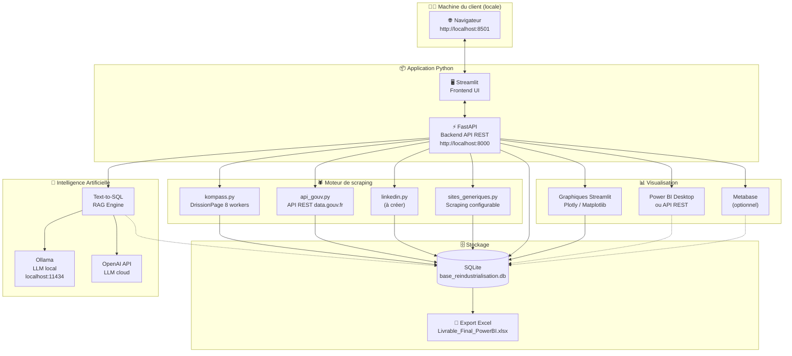
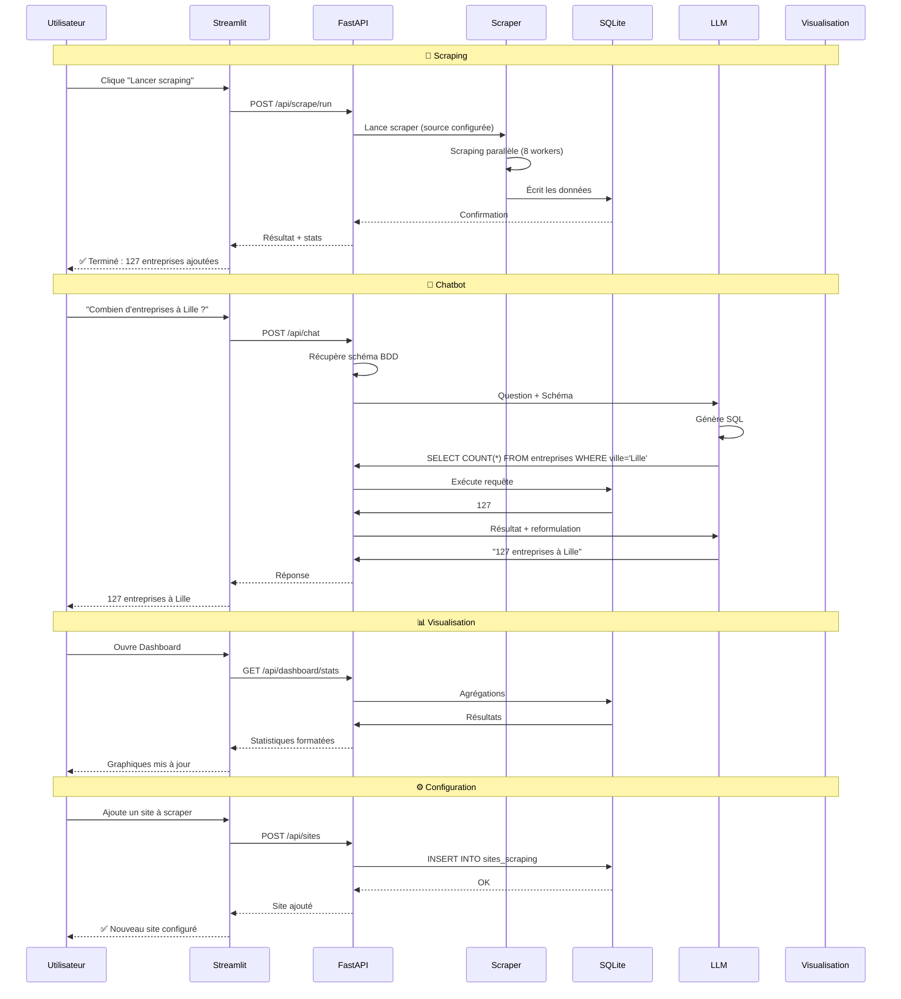
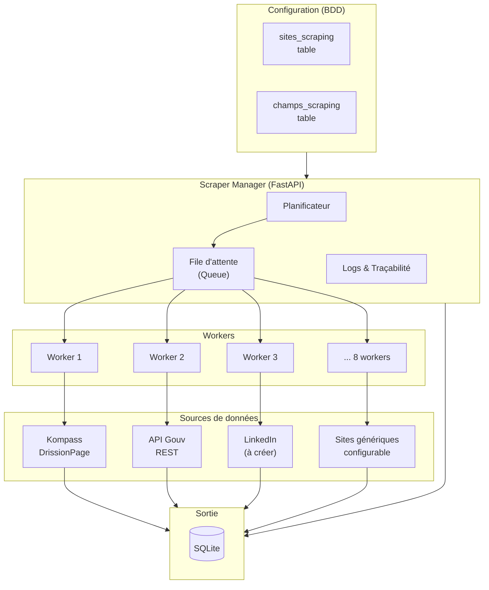
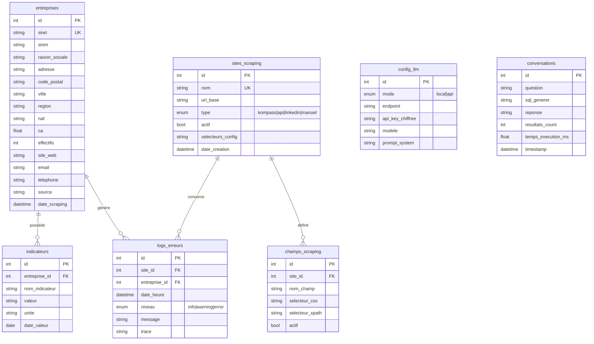
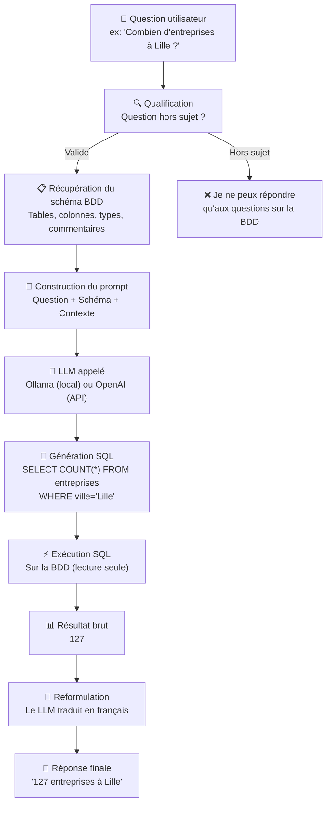
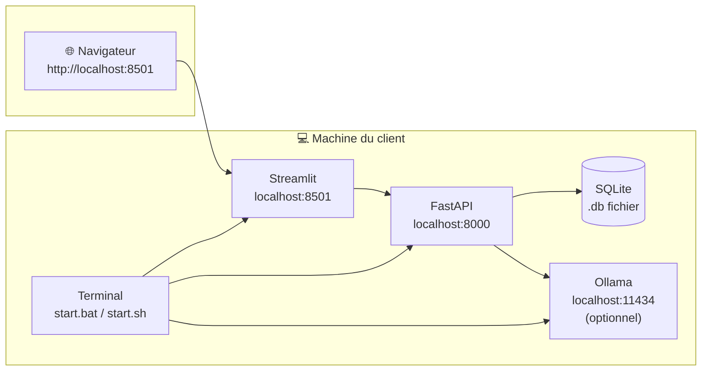

# Architecture de l'Application — Projet G1-G2

> Application de scraping multi-sources, chatbot RAG, visualisation de données et pilotage Power BI
> Version : 1.0 — Juin 2026

---

## Table des matières

1. [Vue d'ensemble](#1-vue-densemble)
2. [Architecture globale](#2-architecture-globale)
3. [Frontend — Interface utilisateur (Streamlit)](#3-frontend--interface-utilisateur-streamlit)
4. [Backend — API REST (FastAPI)](#4-backend--api-rest-fastapi)
5. [Moteur de scraping](#5-moteur-de-scraping)
6. [Base de données](#6-base-de-données)
7. [Chatbot RAG & LLM](#7-chatbot-rag--llm)
8. [Visualisation des données](#8-visualisation-des-données)
9. [Déploiement](#9-déploiement)
10. [Annexes](#10-annexes)

---

## 1. Vue d'ensemble

### 1.1 Problématique

Le client a besoin de :
- Collecter des données industrielles depuis **multiples sources** (Kompass, API gouvernementale, sites web, LinkedIn...)
- **Centraliser** ces données dans une base unique
- **Interroger** la base en langage naturel via un chatbot
- **Visualiser** les données sur des dashboards
- **Piloter** l'ensemble (scraping, configuration, mise à jour) depuis une interface unique
- Garder le contrôle : tout doit fonctionner **en local**, sans abonnement cloud obligatoire

### 1.2 Périmètre fonctionnel

| Fonctionnalité | Description |
|----------------|-------------|
| Scraping multi-sources | Kompass, API Gouv, LinkedIn, sites web génériques |
| Configuration dynamique | Ajouter/supprimer des sites et champs sans modifier le code |
| Base de données centralisée | SQLite, toutes les sources dans la même base |
| Chatbot RAG | Questions en français, réponses depuis la BDD |
| LLM flexible | Local (Ollama) ou API (OpenAI, Mistral...) au choix |
| Visualisation | Graphiques Streamlit + export Power BI |
| Traçabilité | Logs d'erreurs, historique des conversations |

---

## 2. Architecture globale

### 2.1 Schéma d'architecture



### 2.2 Flux de données



### 2.3 Composants principaux

| Composant | Technologie | Rôle |
|-----------|-------------|------|
| Frontend | **Streamlit** | Interface utilisateur (dashboard, chat, config) |
| Backend | **FastAPI** | API REST, orchestration, logique métier |
| Scraping | **DrissionPage** | Extraction de données depuis le web |
| Base de données | **SQLite** | Stockage centralisé de toutes les données |
| Chatbot | **LangChain + Ollama/OpenAI** | RAG, Text-to-SQL |
| Visualisation | **Streamlit Charts + Power BI** | Graphiques et rapports |

---

## 3. Frontend — Interface utilisateur (Streamlit)

### 3.1 Structure de l'interface

L'application Streamlit est organisée en **4 onglets** :

```
app.py
├── Onglet 1 : 📊 Dashboard
│   ├── KPIs : nombre d'entreprises, CA moyen, répartition géographique
│   ├── Graphiques : secteurs d'activité, évolution, carte
│   └── Dernier scraping : date, statut, compteurs
│
├── Onglet 2 : 🕷️ Scraping
│   ├── Boutons : Lancer / Arrêter / Planifier
│   ├── Progression : barre de progression + logs en direct
│   ├── Configuration sites : lister, ajouter, modifier, supprimer
│   └── Configuration champs : lister, ajouter, activer/désactiver
│
├── Onglet 3 : 💬 Chat RAG
│   ├── Sélecteur LLM : Ollama (local) / OpenAI (API)
│   ├── Champ de texte : poser une question
│   └── Historique : conversation avec les réponses
│
└── Onglet 4 : ⚙️ Configuration
    ├── LLM : endpoint, modèle, clé API
    ├── Base de données : chemin, taille, tables
    ├── Power BI : connexion, bouton push
    └── À propos : version, licence
```

### 3.2 Maquette fonctionnelle

```
┌─────────────────────────────────────────────────────────────┐
│  🏠 Dashboard  │  🕷️ Scraping  │  💬 Chat  │  ⚙️ Config  │
├─────────────────────────────────────────────────────────────┤
│                                                             │
│  ┌───────────────────┐  ┌───────────────────┐              │
│  │  📊 Entreprises   │  │  💰 CA Total      │              │
│  │     1 247         │  │     2.3 Mds €     │              │
│  └───────────────────┘  └───────────────────┘              │
│  ┌───────────────────┐  ┌───────────────────┐              │
│  │  🌍 Régions       │  │  🏭 Secteurs      │              │
│  │    [Carte]        │  │    [Pie chart]    │              │
│  └───────────────────┘  └───────────────────┘              │
│                                                             │
│  Dernier scraping : 02/06/2026 14:32 · ✅ Succès            │
│  127 nouvelles entreprises                                │
│                                                             │
└─────────────────────────────────────────────────────────────┘
```

---

## 4. Backend — API REST (FastAPI)

### 4.1 Structure du backend

```
backend/
├── main.py                  # Point d'entrée FastAPI
├── config.py                # Configuration (BDD, LLM, .env...)
├── database.py              # Connexion SQLite, sessions
├── models/                  # Modèles SQLAlchemy / Pydantic
│   ├── entreprise.py
│   ├── site.py
│   ├── champ.py
│   └── conversation.py
├── routers/                 # Endpoints API
│   ├── scraping.py          # POST /api/scrape/run, status, stop
│   ├── sites.py             # CRUD /api/sites
│   ├── champs.py            # CRUD /api/champs
│   ├── chat.py              # POST /api/chat
│   ├── config_llm.py        # GET/PUT /api/config/llm
│   └── powerbi.py           # POST /api/powerbi/push
├── services/                # Logique métier
│   ├── scraper_manager.py   # Orchestrateur de scraping
│   ├── llm_adapter.py       # Adapter Ollama / OpenAI
│   └── rag_engine.py        # Text-to-SQL
└── utils/
    ├── security.py          # Chiffrement clés API
    └── schemas.py           # Schémas Pydantic
```

### 4.2 Liste complète des endpoints

| Méthode | Endpoint | Description |
|---------|----------|-------------|
| **Scraping** | | |
| `POST` | `/api/scrape/run` | Lancer le scraping (tous sites ou par source) |
| `GET` | `/api/scrape/status` | Statut du scraping en cours |
| `POST` | `/api/scrape/stop` | Arrêter le scraping |
| `GET` | `/api/scrape/logs` | Historique des derniers scrapings |
| | | |
| **Sites** | | |
| `GET` | `/api/sites` | Lister tous les sites configurés |
| `POST` | `/api/sites` | Ajouter un nouveau site |
| `GET` | `/api/sites/{id}` | Détail d'un site |
| `PUT` | `/api/sites/{id}` | Modifier un site |
| `DELETE` | `/api/sites/{id}` | Supprimer un site |
| | | |
| **Champs** | | |
| `GET` | `/api/champs` | Lister tous les champs |
| `POST` | `/api/champs` | Ajouter un champ à scraper |
| `PUT` | `/api/champs/{id}` | Modifier un champ |
| `DELETE` | `/api/champs/{id}` | Supprimer un champ |
| | | |
| **Chat / LLM** | | |
| `POST` | `/api/chat` | Envoyer une question au chatbot |
| `GET` | `/api/chat/history` | Historique des conversations |
| `GET` | `/api/config/llm` | Voir la configuration LLM |
| `PUT` | `/api/config/llm` | Changer le mode LLM |
| `GET` | `/api/config/llm/models` | Lister les modèles disponibles |
| | | |
| **Power BI** | | |
| `POST` | `/api/powerbi/push` | Pousser les données vers Power BI |
| `GET` | `/api/powerbi/status` | Statut de la connexion Power BI |
| | | |
| **Dashboard** | | |
| `GET` | `/api/dashboard/stats` | Statistiques globales pour le dashboard |
| `GET` | `/api/dashboard/evolution` | Évolution dans le temps |
| `GET` | `/api/dashboard/geography` | Répartition géographique |

### 4.3 Contrat API — Exemple

**Requête :**
```http
POST /api/chat
Content-Type: application/json

{
  "question": "Quelles sont les entreprises avec un CA > 10M€ dans les Hauts-de-France ?",
  "mode_llm": "local",
  "conversation_id": null
}
```

**Réponse :**
```json
{
  "reponse": "127 entreprises correspondent à vos critères dans les Hauts-de-France. Les 5 premières sont :\n1. **VALEO** (Lille, 45M€)\n2. **ARCELLOR** (Dunkerque, 38M€)\n...",
  "sql_generé": "SELECT * FROM entreprises WHERE ca > 10000000 AND region = 'Hauts-de-France' ORDER BY ca DESC LIMIT 5",
  "resultats_count": 127,
  "temps_execution_ms": 234
}
```

---

## 5. Moteur de scraping

### 5.1 Architecture du scraping



### 5.2 Interface commune des scrapers

Chaque source suit le même contrat pour garantir l'interchangeabilité :

```python
class BaseScraper(ABC):
    """Interface commune que tous les scrapers doivent implémenter."""

    @abstractmethod
    def run(self, config: dict, progression: callable) -> list[dict]:
        """
        Lance le scraping d'une source.

        Args:
            config: Configuration du site (URL, sélecteurs...)
            progression: Callback pour reporter l'avancement

        Returns:
            Liste de dictionnaires (données normalisées)
        """
        pass

    @property
    @abstractmethod
    def nom_source(self) -> str:
        """Identifiant unique de la source (ex: 'kompass', 'linkedin')."""
        pass
```

### 5.3 Scrapers disponibles

| Scraper | Technologie | Source | Statut |
|---------|-------------|--------|--------|
| `kompass.py` | DrissionPage (8 workers) | Kompass.com | ✅ Existant |
| `api_gouv.py` | Requests (REST) | data.gouv.fr | ✅ Existant |
| `linkedin.py` | À définir | LinkedIn | 🔧 À créer |
| `sites_generiques.py` | DrissionPage configurable | Sites web arbitraires | 🔧 À créer |

### 5.4 Scraping dynamique

Le moteur lit la configuration en base de données à chaque exécution :

```python
# Scraper Manager — lecture dynamique de la config
def run_scraping(sources: list[str] = None):
    # 1. Récupère les sites actifs depuis la BDD
    query = "SELECT * FROM sites_scraping WHERE actif = 1"
    if sources:
        query += " AND nom IN :sources"
    sites = db.execute(query, {"sources": sources})

    # 2. Pour chaque site, récupère les champs à scraper
    for site in sites:
        champs = db.execute(
            "SELECT * FROM champs_scraping WHERE site_id = ? AND actif = 1",
            [site.id]
        )
        # 3. Instancie le bon scraper et exécute
        scraper = get_scraper(site.type)  # kompass, api, linkedin...
        donnees = scraper.run({
            "url": site.url_base,
            "champs": champs
        })
        # 4. Sauvegarde en BDD
        batch_insert(db, "entreprises", donnees)
```

**Résultat :** pour ajouter un site ou un champ, il suffit d'insérer une ligne en BDD. Le code ne change jamais.

---

## 6. Base de données

### 6.1 Schéma relationnel



### 6.2 Description des tables

| Table | Description | Source |
|-------|-------------|--------|
| `entreprises` | Données scrapées de toutes les sources | Scraping |
| `indicateurs` | Indicateurs financiers et opérationnels | Scraping / Calculs |
| `sites_scraping` | Configuration des sites à scraper | Manuel / IA |
| `champs_scraping` | Champs à extraire sur chaque site | Manuel / IA |
| `logs_erreurs` | Traçabilité des scrapings et erreurs | Automatique |
| `config_llm` | Configuration du LLM (mode, clé...) | Manuel |
| `conversations` | Historique des questions/réponses du chat | Automatique |

### 6.3 Stockage physique

- **Format** : SQLite (fichier unique `.db`)
- **Emplacement** : `data/base_reindustrialisation.db`
- **Taille** : quelques Mo à quelques Go selon le volume
- **Évolution possible** : PostgreSQL si multi-utilisateur ou volume > 10 Go

---

## 7. Chatbot RAG & LLM

### 7.1 Pipeline Text-to-SQL



### 7.2 Modes LLM

| Mode | Technologie | Avantages | Inconvénients |
|------|-------------|-----------|---------------|
| **Local** | Ollama (llama3, mistral, qwen) | Gratuit, confidentiel, sans internet | Moins performant, nécessite RAM |
| **API** | OpenAI, Mistral API, Anthropic | Plus rapide, plus précis | Nécessite internet + clé API payante |

### 7.3 Adapter LLM

```python
class LLMAdapter:
    """Adaptateur pour basculer entre LLM local et API."""

    def __init__(self, mode: str = "local"):
        self.mode = mode
        self.modele = "llama3.2" if mode == "local" else "gpt-4o-mini"
        self.endpoint = "http://localhost:11434" if mode == "local" else None
        self.api_key = None  # chargée depuis .env ou config BDD

    def ask(self, prompt: str) -> str:
        if self.mode == "local":
            return self._ask_ollama(prompt)
        else:
            return self._ask_openai(prompt)

    def _ask_ollama(self, prompt: str) -> str:
        import requests
        r = requests.post(f"{self.endpoint}/api/generate", json={
            "model": self.modele,
            "prompt": prompt,
            "stream": False
        })
        return r.json()["response"]

    def _ask_openai(self, prompt: str) -> str:
        from openai import OpenAI
        client = OpenAI(api_key=self.api_key)
        r = client.chat.completions.create(
            model=self.modele,
            messages=[{"role": "user", "content": prompt}]
        )
        return r.choices[0].message.content
```

### 7.4 Filtrage des questions hors-sujet

Le chatbot refuse les questions qui ne concernent pas :
- Les entreprises dans la base (CA, effectifs, localisation, secteur...)
- Le scraping (sites, champs, fréquence, logs...)
- Les données et leur analyse

**Mécanisme :**
1. **System prompt** : instructions au LLM pour qu'il se limite au périmètre
2. **Filtre amont** : analyse rapide par mots-clés avant d'appeler le LLM
3. **Vérification aval** : le LLM peut répondre "hors périmètre" si détecté

---

## 8. Visualisation des données

### 8.1 Options disponibles

| Outil | Intégration | Usage |
|-------|-------------|-------|
| **Streamlit (Plotly/Matplotlib)** | Directe dans l'app | Graphiques dashboard, exploration rapide |
| **Power BI Desktop** | Export .xlsx + API REST | Rapports clients avancés |
| **Metabase** | Optionnel, Docker | BI collaboratif, requêtes SQL visuelles |

### 8.2 Flux Power BI

```
Scraping terminé
      ↓
Données en BDD SQLite
      ↓
Option A : Export .xlsx      Option B : API REST Power BI
  → Ouvrir dans Power BI       → Push automatique
  → Rafraîchir manuellement    → Dataset à jour sans intervention
      ↓
Dashboards clients à jour
```

---

## 9. Déploiement

### 9.1 Architecture de déploiement local



### 9.2 Installation client

```bash
# Étape 1 : Installer Python 3.11+
# → https://python.org

# Étape 2 : Installer les dépendances (1 fois)
pip install -r requirements.txt

# Étape 3 : Optionnel — Installer Ollama pour LLM local
# → https://ollama.com
ollama pull llama3.2

# Étape 4 : Lancer l'application (tous les jours)
python start.py
# → Le navigateur s'ouvre sur http://localhost:8501
```

### 9.3 Script de démarrage (start.py)

```python
#!/usr/bin/env python3
"""Point d'entrée de l'application — lance le backend + frontend."""

import subprocess
import time
import webbrowser
import sys

def main():
    print("🚀 Démarrage de l'application...")

    # Lance FastAPI
    backend = subprocess.Popen([
        sys.executable, "-m", "uvicorn",
        "backend.main:app",
        "--host", "127.0.0.1",
        "--port", "8000"
    ])

    # Lance Streamlit
    frontend = subprocess.Popen([
        sys.executable, "-m", "streamlit", "run",
        "frontend/app.py",
        "--server.port", "8501"
    ])

    # Attend que les serveurs soient prêts
    time.sleep(3)

    # Ouvre le navigateur
    webbrowser.open("http://localhost:8501")

    print("✅ Application prête !")
    print("📊 Interface : http://localhost:8501")
    print("🔧 API : http://localhost:8000")
    print("📖 Docs API : http://localhost:8000/docs")

    try:
        # Attend que l'utilisateur tape Ctrl+C
        backend.wait()
    except KeyboardInterrupt:
        print("\n🛑 Arrêt...")
        backend.terminate()
        frontend.terminate()

if __name__ == "__main__":
    main()
```

### 9.4 Fichier requirements.txt

```
fastapi==0.110.0
uvicorn==0.27.0
streamlit==1.35.0
pandas==2.2.0
openpyxl==3.1.2
requests==2.31.0
drissionpage==4.0.4
openai==1.12.0
langchain==0.1.12
langchain-community==0.0.19
python-dotenv==1.0.1
cryptography==42.0.5
plotly==5.18.0
pydantic==2.6.1
```

---

## 10. Annexes

### 10.1 Glossaire

| Terme | Définition |
|-------|------------|
| **API** | Interface de programmation — permet aux composants de communiquer |
| **Backend** | Partie serveur (invisible) qui gère la logique et les données |
| **DrissionPage** | Bibliothèque Python de contrôle navigateur (Chrome) |
| **Endpoint** | URL spécifique d'une API qui exécute une action |
| **Frontend** | Interface visible par l'utilisateur |
| **LLM** | Large Language Model — modèle de langage (GPT, Llama...) |
| **RAG** | Retrieval-Augmented Generation — technique pour répondre depuis une base |
| **REST** | Style d'architecture API basé sur HTTP |
| **Streamlit** | Framework Python pour créer des interfaces web rapidement |
| **Text-to-SQL** | Technique pour convertir une question en français en requête SQL |

### 10.2 Technologies utilisées

```
┌───────────────────────────────────────────────────────────────┐
│                    Application G1-G2                          │
├───────────┬──────────┬──────────┬─────────────┬───────────────┤
│ Frontend  │ Backend  │ Scraping │  IA / LLM   │ Visualisation │
│ Streamlit │ FastAPI  │Drission- │ Ollama      │  Streamlit    │
│ Python    │ Uvicorn  │ Page     │ OpenAI      │  Plotly       │
│ HTML/CSS  │ Pydantic │Requests  │ LangChain   │  Power BI     │
│           │ SQLAlch. │ Chrome   │ Text-to-SQL │  Metabase     │
└───────────┴──────────┴──────────┴─────────────┴───────────────┘
              │                        │
              └────── SQLite ──────────┘
```

### 10.3 Évolutions possibles

- **PostgreSQL** : remplacer SQLite pour du multi-utilisateur
- **Docker** : containeriser l'application pour un déploiement serveur
- **Authentification** : ajouter un login si accès multi-utilisateur
- **Scraping programmé** : planification automatique (daily/weekly)
- **Modèles LLM supplémentaires** : ajouter Claude, Gemini, DeepSeek...
- **Export PDF** : génération de rapports automatiques
- **WebSocket** : remplacer le polling par du temps réel pour les logs scraping

### 10.4 Sécurité

- Les clés API sont **chiffrées** dans la base de données (`cryptography`)
- Les requêtes SQL générées par le LLM sont exécutées en **lecture seule**
- Le chatbot **refuse** les questions hors-sujet (filtre + prompt system)
- L'application tourne **en local** — les données ne quittent pas la machine
- Pas d'authentification requise (usage mono-utilisateur local)

---

> **Document généré le 04/06/2026 — Projet G1-G2**
